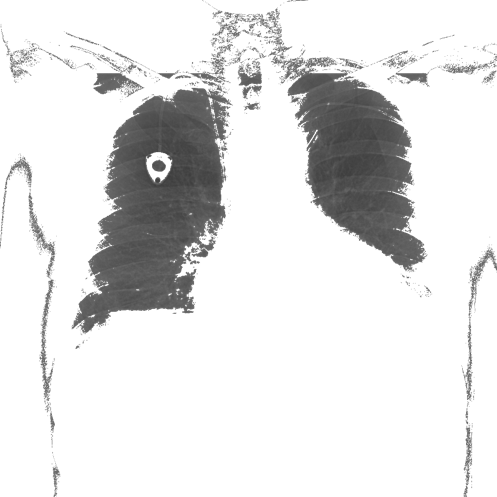

# xray-image-processing

Computer analysis of medical X-ray images involves many complex methods, such as fractal analysis and the use of ML (machine learning). However, you can perform such an analysis at a lower level by examining the basic parameters of the image, which are exposure, contrast, blur and noise. Manipulation of these parameters also allows you to obtain the effect of obfuscation of an X-ray. For difficulty, however, the possibility of obfuscating the image with lesions (tumors) was created. An operation was performed on a set of X-rays of the lungs.

## Methods


Environement: Microsoft Visual Studio WPF (.NET Framework)

### Dataset

[NIH Chest X-ray Dataset](https://www.kaggle.com/nih-chest-xrays/data) was chosen because chest X-rays are one of the most common and cost-effective medical imaging examinations available.

It consists of 112,120 X-ray images with disease markers from 30,805 unique patients.

### Image obfuscation

The purpose of obfuscation was to create a set of simple operations whose combined action was to produce input-like photos, but still to be able to tell wheter the picture is of given patient.

Operations:
- Adding a **circle**. 
	
	It is intended to imitate a tumor in the lungs.

- Adding a **square**. 

	An object that is easy to detect by the first implementations of [tumor detection](#tumor-detection).

- Adding a real [tumor](#tumors) or cancer-like object.

- **Color inversion**.

- Filling the image with a given color utilizing the [Flood Fill](#flood-fill) algorithm.

- **Approximating image with rectangles**.

### Flood Fill

Flood Fill is an algorithm that works in a similar way to the "bucket" tool in Paint. It is used to fill areas of a given or similar color with a different color. Part of the modification depends on the type of image we have - in our case the organ are lungs.


Flood Fill algorithm was used to obtain an image of the lungs themselves and had a two-stage character.

1. **Getting rid of background**, i.e. the dark area appearing at the edges of the image which is not a body.

	A characteristic feature of X-rays of the lungs is the presence of a background at the edges of the image (frame), the color of which is black or close to black. The algorithm "floods" a certain percentage of the darkest pixels in a band of a given width. When a background is detected, its color changes to transparent.

	

2. **Cutting out body** that is not lungs.
	
	Lungs on X-rays are usually darker than the body. To use the whole method implemented in the previous step, it was enough to **invert the image colors**, fill the darkest area as before, and invert the colors again. However, this approach proved to be insufficient.

	

	Lung cutting required additional processing in the form of **approximating the image with rectangles** - the image was divided into squares, whose color was averaged based on the colors of the area. The resulting effect is similar to a pixelated or blurry image. Thanks to this, Flood Fill does not fill the area inside the lungs. After filling the body with a transparent color, the effect of approximating with rectangles is undone to have an accurate picture of the lungs.

	

### Tumors


In the next stage of work on the project, it was decided to increase the realism of the objects added to the lungs. The _Tumor_ class was created. When the application starts, the tumors are loaded from the JSON file and relevant PNG files into the drop-down list in the main application window.

```json
[
    {
        "name": "tumor_b",
        "color": 145
    },
    {
        "name": "tumor_c",
        "color": 145
    }
]
```

PNG files that store tumors have a transparent background. The effect of applying the mask generated in this way is very realistic.

Lungs with two fake tumors         | Real tumor
:---------------------------------:|:----------------------------:
 | 

The tumors are barely visible (middle of the right lung and upper part of the left lung), but they resemble to a large extent real cancer lesions.

Tumors can be added directly to the lung area. In this case, follow these steps:

- Press **Cut lungs** - the lungs are cut out.

- Press **Obtain tumor’s potential places** - an array is stored storing information about the places where the pixel is colored (no background).

- Press **Undo** - it is desirable for us to add tumors to the full picture. The table with potential tumor sites is still stored in the program's memory.

- Select the tumor type and (repeatedly) press **Add in lungs**.

Tumor insertion inside the lungs is random. Its potential sites of addition are limited, but the tumor addition coordinate is randomly selected.

## Tumor detection

1. **Compare bit by bit**

	Comparing the original and the modified image. Although this is not a type of detection, it allows for accurate identification of changes (circles, squares, tumors) regardless of their shape.

Obfuscated image              	   | Detected tumors
:---------------------------------:|:----------------------------:
 | 

2. **Compare 4^n subimages**
	
	Comparing the original image with the modified one. It is also not a type of detection. The function divides the original and modified image into 4^n images and paints redesigned rectangular sub-areas. Higher saturation of red corresponds to more changed pixels in the sub-image.

Obfuscated image              	   | Detected tumors
:---------------------------------:|:----------------------------:
 | 

3. **Detect fixed squares**

	Detection of squares with predefined, fixed sizes with a configurable _detection threshold [%]_. The task was to prepare for more complicated detection, which is tumor detection.

Obfuscated image              	   | Detected tumors
:---------------------------------:|:----------------------------:
 | 

4. **Detect tumors**

	Detection of tumors from the tumor collection stored in the _Resources/tumors_ location as PNG images and their description attached in the _tumors.json_ file. The _detection threshold [%]_ is also used, which only applies to colored pixels of the tumor image (without its transparent background).

Obfuscated image              	   | Detected tumors
:---------------------------------:|:----------------------------:
 | 


## Results

Complicated methods are not required in order to perform image analysis. With simple and uncomplex methods of image processing and by learning the characteristics of X-ray images it is possible to achieve pretty nice effects.


